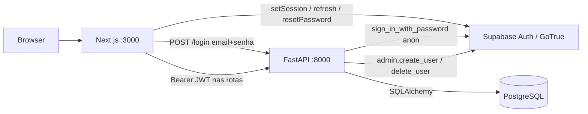

# Estoque Delta

Sistema interno de **gestão de estoque de máquinas POS** da equipe Delta.

Controla, por máquina:

- **quem tem** (cliente identificado pelo MID);
- **de onde veio** (fornecedor);
- se está com um **parceiro** (cliente com a tag `parceiro`);
- se está em **evento** (lote com datas; só a aba Eventos liga/desliga);
- o **estado** operacional: `NO CLIENTE`, `ESTOQUE`, `REPARO`, `MAQUINA PERDIDA`;
- se foi **comprada** ou **alugada** (`COMPRADA` / `ALUGADA`).

Há duas aplicações neste repositório e um backend gerido (Supabase Auth + PostgreSQL).

| Pasta | Tecnologia | Porta | Função |
| --- | --- | --- | --- |
| [`backend_estoque/`](backend_estoque/) | FastAPI, SQLAlchemy, Alembic | **8000** | API, regras, JWT, Postgres |
| [`frontend_estoque/`](frontend_estoque/) | Next.js 16, React 19, Tailwind 4 | **3000** | Telas, sessão, tema |
| Projeto Supabase | Auth GoTrue + PostgreSQL | — | Identidade e dados |

**Não commitar** `.env` nem `.env.local`. Modelos: [`backend_estoque/.env.example`](backend_estoque/.env.example) e [`frontend_estoque/.env.example`](frontend_estoque/.env.example).

---

## Índice

1. [Documentação detalhada](#documentação-detalhada)
2. [Visão dos módulos](#visão-dos-módulos)
3. [Menu e rotas da UI](#menu-e-rotas-da-ui)
4. [Stack](#stack)
5. [Arquitetura](#arquitetura)
6. [Arranque](#arranque)
7. [Variáveis de ambiente](#variáveis-de-ambiente)
8. [Modelo de dados (resumo)](#modelo-de-dados-resumo)
9. [API (resumo)](#api-resumo)
10. [Regras de negócio](#regras-de-negócio)
11. [Autenticação e sessão](#autenticação-e-sessão)
12. [Testes e qualidade](#testes-e-qualidade)
13. [Primeiro admin](#primeiro-admin)
14. [Glossário curto](#glossário-curto)

---

## Documentação detalhada

O README é o ponto de entrada. O detalhe fino (cada campo, cada `detail` de erro, cada trigger) está em `docs/`:

| Ficheiro | Conteúdo |
| --- | --- |
| [`docs/glossario.md`](docs/glossario.md) | MID, parceiro, situação vs status, JWT, idle |
| [`docs/fluxos.md`](docs/fluxos.md) | Passo a passo de cada ecrã e que HTTP dispara |
| [`docs/regras-de-negocio.md`](docs/regras-de-negocio.md) | Tabelas “se isto → 400 / grava / ignora” |
| [`docs/arquitetura.md`](docs/arquitetura.md) | Ciclo do pedido, JWKS, CORS, Header |
| [`docs/modelo-de-dados.md`](docs/modelo-de-dados.md) | Colunas, CHECKs, triggers, FKs, Alembic |
| [`docs/api.md`](docs/api.md) | Endpoints, query, body, mensagens exactas |
| [`docs/frontend.md`](docs/frontend.md) | Debounce, paginação, filtros URL, campos |
| [`docs/mapa-de-arquivos.md`](docs/mapa-de-arquivos.md) | Função de cada `.py` / `.tsx` |
| [`docs/operacao.md`](docs/operacao.md) | `.env`, testes, CSV, problemas frequentes |

---

## Visão dos módulos

**Painel (`/`)**  
Uma chamada `GET /dispositivos/dashboard` (e `GET /usuarios/me` para saber se mostra o card de usuários). Cards: máquinas, clientes, fornecedores, máquinas em parceiro, máquinas `em_evento`, usuários (**só ADMIN**). Se existir evento **PENDENTE**, faixa “Pendência de devolução” (link para `/eventos`). Gráficos de pizza por modelo, fatiados por estado.

**Máquinas (`/dispositivos`)**  
Lista paginada (20). Busca por serial ou MID (debounce 500 ms). Filtros `?evento=true` e `?parceiro=true`. Clique no card abre modal (editar/excluir). **Em evento** no formulário é **mostrador** Sim/Não — não há dropdown. Quem coloca/tira a máquina de evento é só a aba Eventos. A API ignora `em_evento` no POST/PUT de `/dispositivos`. Cadastro novo (`/novo-dispositivo`) aceita **lote** de seriais (`POST /dispositivos/lote`). Parceiro continua Sim/Não com dropdown do cliente parceiro.

**Clientes (`/clientes`)**  
Aba no menu. Busca por razão social, fantasia ou MID. Card abre ficha: nome, fantasia, MID, tag Parceiro, salvar, excluir.

**Eventos (`/eventos`)**  
Lote: um MID + data início + data fim + N seriais. Ao digitar o MID, a UI confirma o nome do cliente (igual aos outros formulários). Depois da data de término, situação **PENDENTE** (cobrar devolução). **Finalizar evento** só depois do modal de confirmação; a API tira `em_evento` de todas as vinculadas. O histórico em `evento_dispositivo` permanece.

**Parceiros (`/parceiros`)**  
Aba no menu. Lista clientes com `parceiro=true`. Card abre ficha: nome, fantasia, MID, máquinas vinculadas **só leitura** (serial não se edita aqui). Alta em `/parceiros/novo`.

**Cadastros (`/cadastros`)**  
Hub para *criar*: máquina (uma ou em lote no mesmo formulário), cliente, fornecedor, parceiro (`/parceiros/novo`), usuário (se ADMIN).

**Usuários**  
Só no menu se `GET /usuarios/me` devolver `perfil === "ADMIN"`. Cria o user no Supabase Auth e a linha em `dados_usuario`.

Perfis: **COMUM** (estoque) e **ADMIN** (estoque + usuários).

---

## Menu e rotas da UI

Menu (`md+`): Painel · Máquinas · Eventos · Parceiros · Clientes · Cadastros · Usuários (admin).

| Caminho | Ecrã |
| --- | --- |
| `/login` | E-mail, senha, lembrar de mim → `POST /login` |
| `/esqueci-senha` | Reset via Supabase Auth |
| `/redefinir-senha` | Nova senha após o e-mail |
| `/` | Painel |
| `/dispositivos` | Máquinas (`?evento=true`, `?parceiro=true`) |
| `/novo-dispositivo` | Alta de máquina (lote) |
| `/eventos` | Lista (PENDENTE primeiro na UI) |
| `/eventos/novo` | Lote |
| `/eventos/[id]` | Detalhe + modal finalizar |
| `/parceiros` | Lista de parceiros (tag `cliente.parceiro`) |
| `/parceiros/novo` | Alta |
| `/parceiros/[id]` | Ficha: dados + seriais só leitura |
| `/clientes` | Lista + modal edição |
| `/novo-cliente` | Alta (`?parceiro=true` já marca a tag) |
| `/fornecedores` | Lista |
| `/novo-fornecedor` | Alta |
| `/cadastros` | Hub de formulários |
| `/usuarios` | Admin |
| `/novo-usuario` | Alta admin |
| `/novo-adquirente` | Legado (não usar para parceiro) |

Rotas públicas (sem Header): `/login`, `/esqueci-senha`, `/redefinir-senha`.

---

## Stack

| Peça | Versão no repo |
| --- | --- |
| API | FastAPI 0.136.1, Uvicorn 0.47.0 |
| ORM | SQLAlchemy 2.0.49, Alembic 1.16.5, psycopg2 2.9.12 |
| Auth API | supabase 2.31.0, PyJWT 2.13.0, cryptography 49.0.0 |
| Rate limit | slowapi 0.1.9 |
| Front | next 16.2.6, react 19.2.4, @supabase/supabase-js, recharts, next-themes, Tailwind 4 |
| Testes | pytest 8.4.2, pytest-cov 6.3.0, bandit 1.9.4, cobertura mínima **85%** |

---

## Arquitetura



O browser **não** manda a senha directo ao GoTrue no login da tela principal:

1. UI → `POST /login` na FastAPI (chave **anon** no servidor).
2. API devolve `access_token` + `refresh_token`.
3. UI faz `supabase.auth.setSession(...)` e guarda o access token em memória.
4. `apiFetch` envia `Authorization: Bearer …`.
5. HTTP 401 → `refreshSession`; se falhar, sign out e `/login`.

Recuperação de senha usa o supabase-js (e-mail do Auth), não a FastAPI.

Detalhe: [`docs/arquitetura.md`](docs/arquitetura.md).

---

## Arranque

Pré-requisitos: Python 3.11+ (os testes deste repo correram em 3.14), Node.js 20+, projecto Supabase, Postgres pelo **Session pooler IPv4**. No Windows o host `db.*.supabase.co` é IPv6-only e o Python falha com `getaddrinfo`.

### Backend

```powershell
cd backend_estoque
python -m venv .venv
.\.venv\Scripts\Activate.ps1
pip install -r requirements-dev.txt
copy .env.example .env
# preencher .env
.\.venv\Scripts\python.exe -m alembic upgrade head
.\.venv\Scripts\python.exe -m uvicorn main:app --reload --host 127.0.0.1 --port 8000
```

- API: http://127.0.0.1:8000  
- OpenAPI / Swagger: http://127.0.0.1:8000/docs  

### Frontend

```powershell
cd frontend_estoque
copy .env.example .env.local
# preencher .env.local
npm install
npm run dev
```

App: http://127.0.0.1:3000  

O primeiro request autenticado de um e-mail que já existe no Auth cria `dados_usuario` com perfil **COMUM** e status **ATIVO**, se a linha ainda não existir.

Apidog / Postman: `POST http://127.0.0.1:8000/login` — **não** é `/auth/v1`. Depois Bearer nas outras rotas.

Passos extra (CSV, Alembic, problemas frequentes): [`docs/operacao.md`](docs/operacao.md).

---

## Variáveis de ambiente

### Backend (`backend_estoque/.env`)

| Variável | Uso |
| --- | --- |
| `DATABASE_URL` | Session pooler, `sslmode=require`, user `postgres.PROJECT_REF` |
| `SUPABASE_URL` | JWKS + clientes Auth |
| `SUPABASE_ANON_KEY` | `POST /login` (mesma chave anon do front) |
| `SUPABASE_SERVICE_ROLE_KEY` | Criar/apagar users no Auth. **Nunca** no frontend |
| `SUPABASE_JWT_SECRET` | Opcional; só JWT HS256 legado |
| `CORS_ORIGINS` | Origens do Next (incluir a porta exacta: 3000 ou 3001) |
| `ADMIN_RESET_EMAIL` / `ADMIN_RESET_PASSWORD` | Só o script local `reset_pass.py` |

Rate limit do login está no código: **5/minuto por IP**.

### Frontend (`frontend_estoque/.env.local`)

| Variável | Uso |
| --- | --- |
| `NEXT_PUBLIC_API_URL` | Default `http://127.0.0.1:8000` se omitida |
| `NEXT_PUBLIC_SUPABASE_URL` | Obrigatória |
| `NEXT_PUBLIC_SUPABASE_ANON_KEY` | Obrigatória; só a chave **anon** |

Reiniciar `next dev` depois de alterar `NEXT_PUBLIC_*`.

---

## Modelo de dados (resumo)

Tabelas: `cliente`, `fornecedor`, `dispositivos`, `evento`, `evento_dispositivo`, `dados_usuario`, `adquirente` (legado).

- **Parceiro** não é tabela: é `cliente.parceiro`. `dispositivos.adquirente` aponta para `cliente.id`.
- **Evento actual** da máquina: `dispositivos.evento_id` + flag `em_evento`. Histórico do lote: `evento_dispositivo`.
- Serial, MID, código de fornecedor e e-mail: **únicos quando preenchidos**; vazio grava-se `NULL`.
- CHECK de estoque: máquina em `ESTOQUE` não pode ter cliente **e** fornecedor ao mesmo tempo (`NOT VALID` no legado; writes novos são recusados).
- Situação do evento (`ABERTO` / `PENDENTE` / `FINALIZADO`) **não** é coluna: a API calcula. No banco, `status` só é `ABERTO` ou `FINALIZADO`.

Cadeia Alembic até `head`: `dc5e5bbe4009` → `b7c91a2e4d10` → `c8d4e1f2a3b0` → `d9e5f2a1b4c3` → `e1b2c3d4e5f6` → `f2a3b4c5d6e7`.

Colunas, triggers e FKs: [`docs/modelo-de-dados.md`](docs/modelo-de-dados.md).

---

## API (resumo)

Base `http://127.0.0.1:8000`. Autenticado: `Authorization: Bearer <jwt>`, excepto `GET /` e `POST /login`.

| Método | Caminho | Notas |
| --- | --- | --- |
| GET | `/` | Público |
| POST | `/login` | `{ email, senha }` → JWT; 5/min/IP |
| GET/POST/PUT/DELETE | `/clientes` | Query: `search`, `page`, `limit`, `parceiro` |
| GET/POST/PUT/DELETE | `/fornecedores` | Lista sem paginação |
| GET | `/dispositivos` | `search`, `page`, `limit`, `em_evento`, `parceiro`, `adquirente_id` |
| GET | `/dispositivos/dashboard` | Totais + `agrupamento_modelos` + `total_eventos_pendentes` + `total_usuarios` |
| POST/PUT/DELETE | `/dispositivos`, `/dispositivos/{id}` | Body com `mid`, `fornecedor_nome`, `adquirente_nome`; **não** altera `em_evento` |
| POST | `/dispositivos/lote` | `numero_seriais` + mesmos vínculos; tudo ou nada |
| GET/POST/PUT/DELETE | `/parceiros` | Recorte de cliente com `parceiro=true`; GET inclui máquinas só para leitura |
| GET/POST | `/eventos` | Lote por MID + seriais |
| GET | `/eventos/{id}` | Detalhe |
| POST | `/eventos/{id}/finalizar` | Tira todas de evento |
| GET | `/usuarios/me` | Qualquer autenticado |
| GET/POST/PUT/DELETE | `/usuarios` | Só ADMIN |
| * | `/adquirentes` | Legado |

O front resolve cliente/fornecedor/parceiro por **texto**; a API traduz para IDs.

Erros e bodies: [`docs/api.md`](docs/api.md).

---

## Regras de negócio

- Serial / MID / código / e-mail únicos se preenchidos.
- Estados da máquina: `NO CLIENTE` \| `ESTOQUE` \| `REPARO` \| `MAQUINA PERDIDA` (sem acento no valor gravado).
- `ESTOQUE` + MID + fornecedor ao mesmo tempo → 400.
- Parceiro da máquina = cliente com `parceiro = true`, escolhido pelo **nome**.
- **Evento só pela aba Eventos.** POST `/dispositivos` e `/dispositivos/lote` forçam `em_evento = false`. PUT da máquina não mexe na flag nem no `evento_id`.
- Criar evento **não** altera estado, MID nem fornecedor da máquina (evita partir o CHECK de estoque).
- Só entra no lote máquina que **não** está `em_evento`. Seriais repetidos no payload contam uma vez.
- **PENDENTE** = `status` ABERTO e `data_fim` anterior a hoje (data do servidor; comparação estrita `<`). Serve para cobrar a devolução. Não impede finalizar.
- Finalizar: confirmação na UI → `FINALIZADO` + `em_evento = false` em todas. Histórico N:N permanece.
- Não há endpoint de reabrir evento.
- Login: mensagem genérica; 5 tentativas / minuto / IP.
- Utilizador `INATIVO` → 403 mesmo com JWT válido.
- Não é possível DELETE do próprio utilizador.

Tabelas de decisão: [`docs/regras-de-negocio.md`](docs/regras-de-negocio.md).

---

## Autenticação e sessão

| Recurso | Comportamento |
| --- | --- |
| JWT actual | ES256/RS256 via JWKS; `audience=authenticated`; leeway 30 s |
| JWT legado | HS256 + `SUPABASE_JWT_SECRET` |
| Primeiro acesso | Cria linha COMUM/ATIVO em `dados_usuario` |
| Lembrar de mim | `localStorage` vs `sessionStorage` (`estoque-delta-remember`) |
| Validade máxima | 7 dias desde o login (mesmo com “lembrar de mim”) → `/login?expirada=1` |
| Idle | 15 min sem rato/teclado/scroll/touch → `/login?inativo=1` (só se “lembrar de mim” estiver desligado) |
| Admin | `perfil` tem de ser a string exacta `ADMIN` |

---

## Testes e qualidade

```powershell
cd backend_estoque
.\check.ps1
```

Corre pytest (`-v`, cobertura **≥ 85%**, falha abaixo) e Bandit. Os testes usam **SQLite em memória** e não precisam do Postgres. `get_current_user` é substituído nas rotas; JWT real está em `tests/test_deps.py` / `test_auth.py`.

O hook de pre-commit (`.pre-commit-config.yaml` na raiz) dispara o mesmo `check.ps1` quando o commit inclui ficheiros em `backend/`. Uma vez por clone: `.\backend\.venv\Scripts\pre-commit.exe install`.

| Ficheiro | Cobre |
| --- | --- |
| `tests/test_public.py` | `GET /`; 401 sem token |
| `tests/test_auth.py` | Login 401/200/429/500 |
| `tests/test_deps.py` | JWT, inativo, auto-create |
| `tests/test_cadastros.py` | Clientes, fornecedores, adquirentes |
| `tests/test_dispositivos.py` | Lista, dashboard, ESTOQUE, POST/PUT não mudam evento |
| `tests/test_eventos.py` | Lote, PENDENTE, finalizar |
| `tests/test_usuarios.py` | `/me`, admin, CRUD |
| `tests/test_helpers.py` | `empty_to_none` |
| `tests/test_database.py` | `get_db` fecha a sessão |

---

## Primeiro admin

1. Criar o user no Auth (Dashboard Supabase) **ou** entrar uma vez (fica COMUM).
2. No Postgres: `UPDATE dados_usuario SET perfil = 'ADMIN' WHERE email = 'seu@email';`
3. Recarregar a UI — aparece a aba Usuários.

Script local `backend_estoque/reset_pass.py` redefine senha no Auth via service_role (`ADMIN_RESET_*` no `.env`). Não é rota HTTP.

Importação CSV: `importar_excel.py` + `dados.csv` na pasta do backend (ver [operação](docs/operacao.md)).

---

## Glossário curto

| Termo | Significado |
| --- | --- |
| **MID** | Identificador do cliente; unique se preenchido |
| **Parceiro** | Flag no cliente, não tabela |
| **em_evento** | Flag na máquina; só o módulo Eventos altera |
| **status (evento)** | `ABERTO` ou `FINALIZADO` no banco |
| **situacao (evento)** | `ABERTO`, `PENDENTE` ou `FINALIZADO` na API/UI |
| **PENDENTE** | Evento aberto com data de término já passada |
| **COMUM / ADMIN** | Perfis em `dados_usuario` |

Lista completa: [`docs/glossario.md`](docs/glossario.md).
