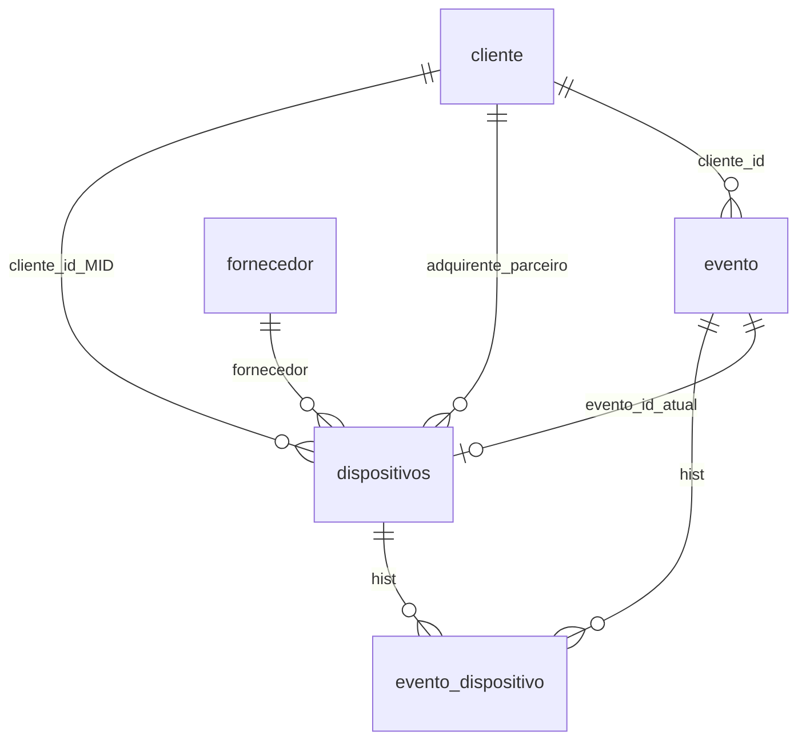

# Modelo de dados

PostgreSQL (Supabase). SQLAlchemy em `models.py` espelha os nomes reais das tabelas.

---

## `cliente`

| Coluna | Tipo | Nulo | Default | Notas |
| --- | --- | --- | --- | --- |
| id | Integer PK | não | serial | index |
| nome | String(255) | não | | Razão social |
| nome_fantasia | String(255) | sim | | |
| mid | String(100) | sim | | Unique parcial |
| status | String(50) | sim | | Texto livre |
| parceiro | Boolean | não | false | Tag de parceiro |
| created_at | DateTime | sim | now() | |

**Índice** `uq_cliente_mid` UNIQUE WHERE `mid IS NOT NULL AND mid <> ''`.

**CHECK** `ck_cliente_mid_nao_vazio`: `mid IS NULL OR mid <> ''`.

**Trigger** `trg_cliente_before_write`: se `btrim(mid) = ''` → `mid := NULL`.

Relações ORM: `dispositivos` (FK `dispositivos.cliente`), `dispositivos_parceiro` (FK `dispositivos.adquirente`), `eventos`.

---

## `fornecedor`

| Coluna | Tipo | Nulo | Notas |
| --- | --- | --- | --- |
| id | Integer PK | não | |
| nome | String(255) | não | A API resolve máquina por **igualdade exacta de nome** |
| codigo | String(50) | sim | Unique parcial |
| status | String(50) | sim | |
| created_at | DateTime | sim | now() |

**Índice** `uq_fornecedor_codigo`. **CHECK** `ck_fornecedor_codigo_nao_vazio`. **Trigger** `trg_fornecedor_before_write` (código vazio → NULL).

---

## `dispositivos`

| Coluna | Tipo | Nulo | Default | Notas |
| --- | --- | --- | --- | --- |
| id | Integer PK | não | | |
| modelo | String(50) | sim | | |
| numero_serial | String(100) | sim | | Unique parcial |
| estado | String(50) | sim | | Ver CHECK |
| aquisicao | String(20) | sim | | `COMPRADA` ou `ALUGADA`; legado preenchido com `ALUGADA` |
| fornecedor | Integer FK | sim | | → `fornecedor.id` |
| cliente | Integer FK | sim | | → `cliente.id` (MID) |
| adquirente | Integer FK | sim | | → `cliente.id` ON DELETE SET NULL (parceiro) |
| em_evento | Boolean | não | false | Só router de eventos altera |
| evento_id | Integer FK | sim | | → `evento.id` ON DELETE SET NULL (evento actual) |
| data_chegada | DateTime | sim | | POST da API |
| data_ultima_atualizacao | DateTime | sim | | POST/PUT + trigger |

**Índice** `uq_dispositivos_numero_serial`.

**CHECK `ck_dispositivos_serial_nao_vazio`:** serial NULL ou `<> ''`.

**CHECK `ck_dispositivos_estado`:** NULL ou um de:

- `NO CLIENTE`
- `ESTOQUE`
- `REPARO`
- `MAQUINA PERDIDA` (sem acento)

**CHECK `ck_dispositivos_aquisicao`:** NULL ou `COMPRADA` | `ALUGADA`.

**CHECK `ck_dispositivos_estoque`:**  
`estado IS NULL OR estado <> 'ESTOQUE' OR cliente IS NULL OR fornecedor IS NULL`  
Foi criado **NOT VALID**: linhas antigas ESTOQUE+cliente+fornecedor podem existir; **writes novos** são recusados. Validar no Postgres só depois de limpar legado (`ALTER TABLE … VALIDATE CONSTRAINT`).

**Trigger** `trg_dispositivos_before_write` / função `estoque_dispositivos_before_write`:

- serial/estado só espaços → NULL
- UPDATE: `data_ultima_atualizacao := now()`
- INSERT se essa data é NULL: `now()`

---

## `evento`

| Coluna | Tipo | Nulo | Default | Notas |
| --- | --- | --- | --- | --- |
| id | Integer PK | não | | index `ix_evento_id` |
| nome | String(255) | sim | | |
| cliente_id | Integer FK | não | | → `cliente.id` |
| data_inicio | Date | não | | |
| data_fim | Date | não | | |
| status | String(20) | não | `ABERTO` | |
| created_at | DateTime | sim | now() | |
| data_finalizacao | DateTime | sim | | Só ao finalizar |

**CHECK `ck_evento_status`:** `ABERTO` | `FINALIZADO`.  
**CHECK `ck_evento_datas`:** `data_fim >= data_inicio`.

A coluna **situacao** não existe no banco — a API calcula.

---

## `evento_dispositivo`

| Coluna | Tipo | Notas |
| --- | --- | --- |
| evento_id | Integer PK, FK evento ON DELETE CASCADE | |
| dispositivo_id | Integer PK, FK dispositivos ON DELETE CASCADE | |

Histórico do lote. Finalizar **não** apaga estas linhas. `qtd_maquinas` na API = `len(evento.dispositivos)` via secondary.

---

## `dados_usuario`

| Coluna | Tipo | Nulo | Default | Notas |
| --- | --- | --- | --- | --- |
| id | Integer PK | não | | |
| nome | String(255) | não | | No auto-create: parte local do e-mail |
| nome_fantasia | String(255) | sim | | |
| status | String(50) | sim | | Comparação INATIVO: `(status or "").upper() == "INATIVO"` |
| perfil | String(50) | não | `COMUM` | `ADMIN` ou `COMUM` (string exacta) |
| email | String(255) | sim | | Unique parcial; match do JWT |
| created_at | DateTime | sim | now() | |

**Índice** `uq_dados_usuario_email`. **CHECK** `ck_usuario_email_nao_vazio`. **Trigger** `trg_dados_usuario_before_write`.

Não há coluna de senha.

---

## `adquirente` (legado)

`id` Integer PK, `nome` String(100) index. Sem relação actual com `dispositivos` (a FK foi retarget para `cliente`).

---

## Uniques parciais (ideia)

Vários `NULL` permitidos. Dois `'ABC'` não. A API chama `empty_to_none` **antes** de gravar MID/serial/código/e-mail para não gravar `''` (que o CHECK também proíbe).

---

## Migrações (cadeia)

`dc5e5bbe4009` → `b7c91a2e4d10` → `c8d4e1f2a3b0` → `d9e5f2a1b4c3` → `e1b2c3d4e5f6` → `f2a3b4c5d6e7` (head).

Comandos: `alembic current` / `alembic upgrade head`. `env.py` faz `load_dotenv()` e exige `DATABASE_URL`.

---

## SQLite nos testes

`Base.metadata.create_all` no engine `sqlite://` (StaticPool). `PRAGMA foreign_keys=ON`. CHECKs do SQLAlchemy são emitidos; triggers PL/pgSQL **não** existem no SQLite — as regras de `''` → NULL nos testes dependem de `empty_to_none` na API.
